# confocal laser microscope

Here you will find a gallery of some of the things I have scanned with this confocal laser microscope I built. Some later scans will have a plot of a "height map" and "magnitude map". The value of each pixel in the height map is the (estimated) height of that pixel, as measured by the confocal optical system. The value of each pixel in the magnitude map is the magnitude of light detected by the photodiode at the (estimated) height of that pixel, as measured by the confocal optical system.

## penny
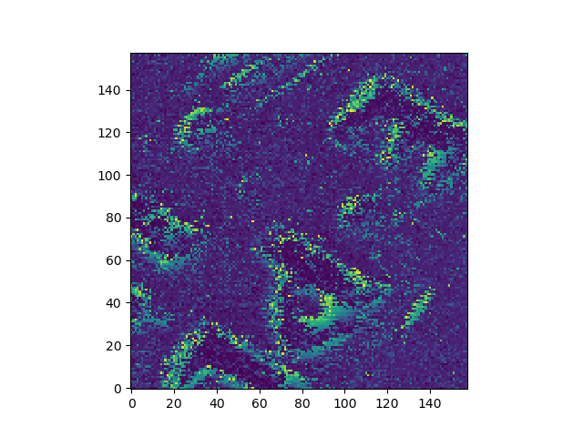
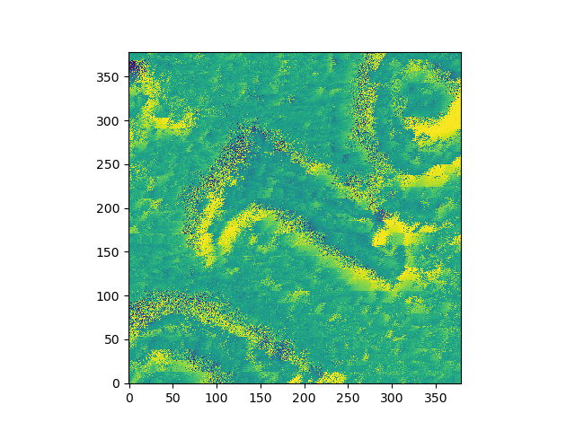
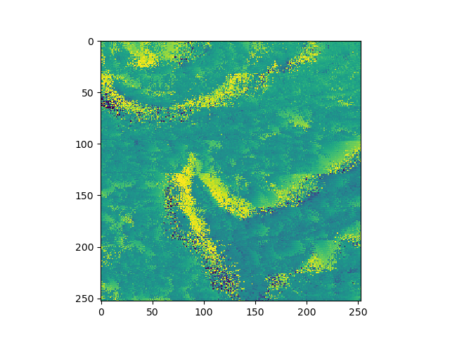

## sandpaper
some scans of sandpaper to get a sense of my microscope's "noise floor"

### 120 grit
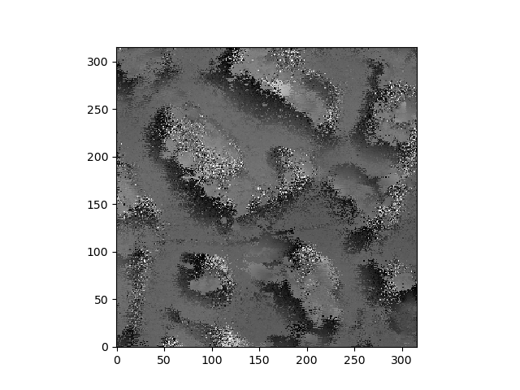

### 150 grit
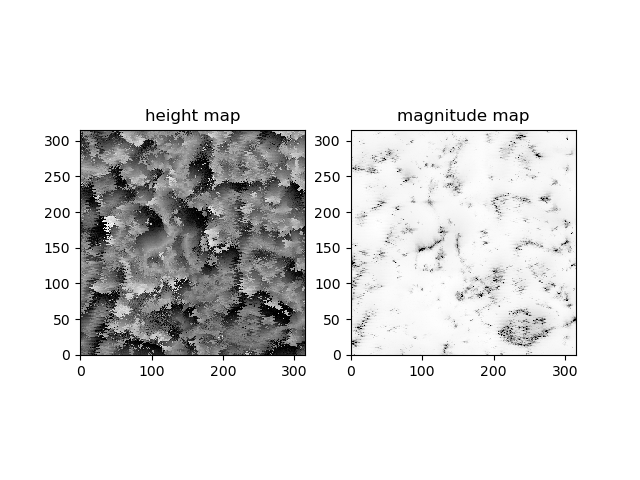

### 220 grit
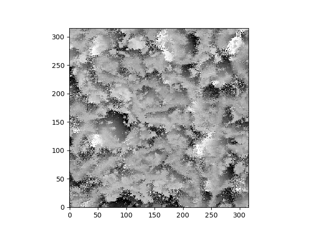

### 320 grit
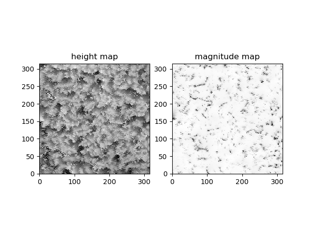

### 600 grit
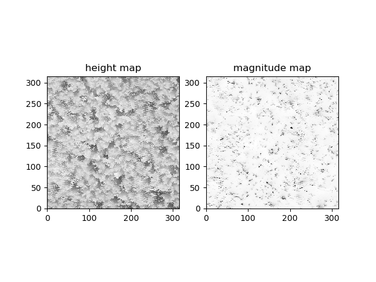

### 2400 grit
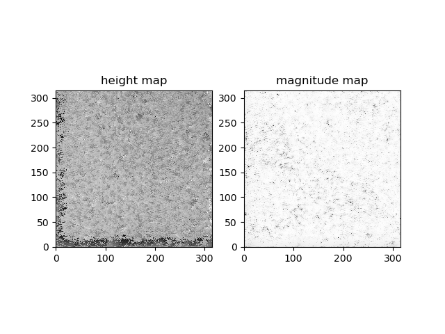

Note the artifacts along the left and bottom edge where the measured height differs significantly from the rest of the scan. It turns out I was unintentionally doing some lithography as my laser had darkened the area that I was scanning.

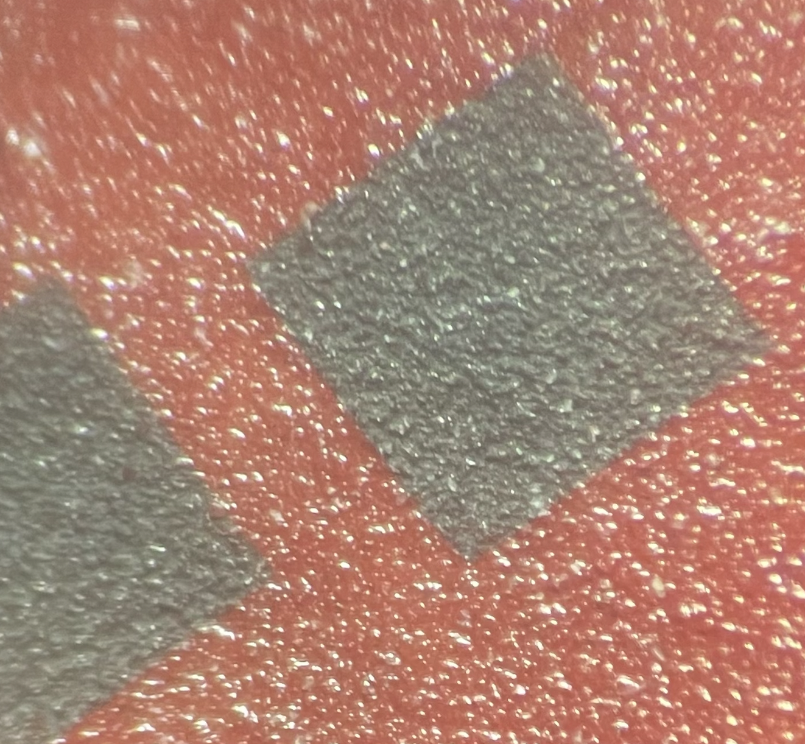

Some of the burnt 1mm squares as seen on the sandpaper after scanning

## fabrics
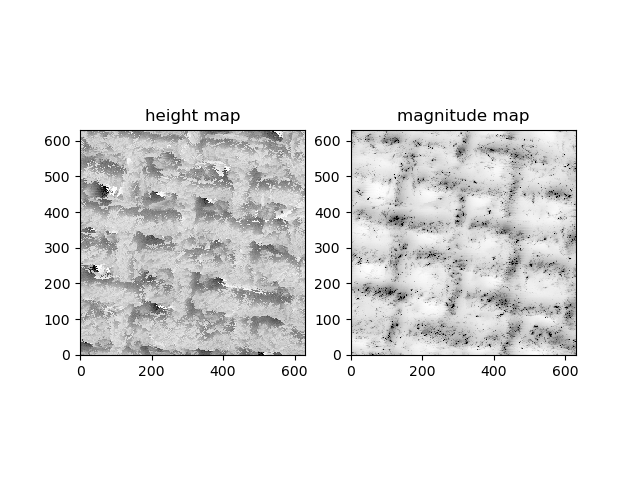
